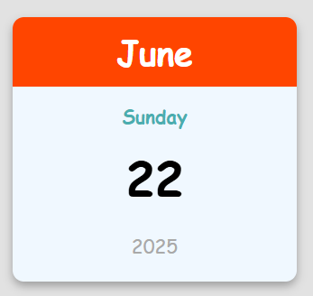

# Mini Calendar

## Overview
This project is a mini calendar built with HTML, CSS, and JavaScript. It displays the current date, including the full month name, day of the week, day number, and year, in a stylish and responsive layout.

## ## Screenshots


## Features
- **Current Date Display**: Shows the current date in a 12-month format.
- **Responsive Design**: Adjusts font sizes and layout for various screen sizes.
- **Modern UI**: Styled with a light background, shadows, and a cursive font.

## Tech Stack
- **HTML5**: For semantic structure.
- **CSS3**: For styling (flexbox, media queries, shadows).
- **JavaScript**: For dynamically displaying the current date.

## Installation
1. Clone the repository:
   ```bash
   git clone https://github.com/AliDevHub/mini-calendar.git

## How It Works
1. The calendar displays the current date (e.g., "June 22, 2025, Sunday").
2. The design uses a centered container with a light background and colorful text.
3. Font sizes adjust automatically on smaller screens for better readability.

#### Notes on the README:
- **Live Demo**: I’ve included a placeholder GitHub Pages URL (`https://alidevhub.github.io/mini-calendar/` You’ll need to enable GitHub Pages to make this link work (see Step 4 below).

